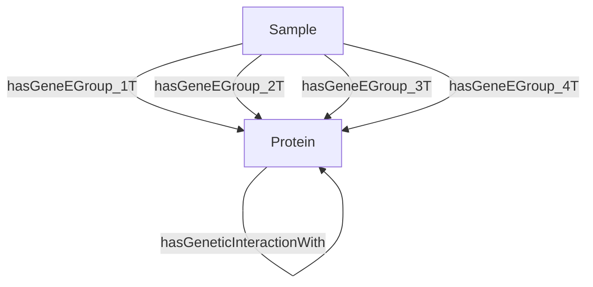
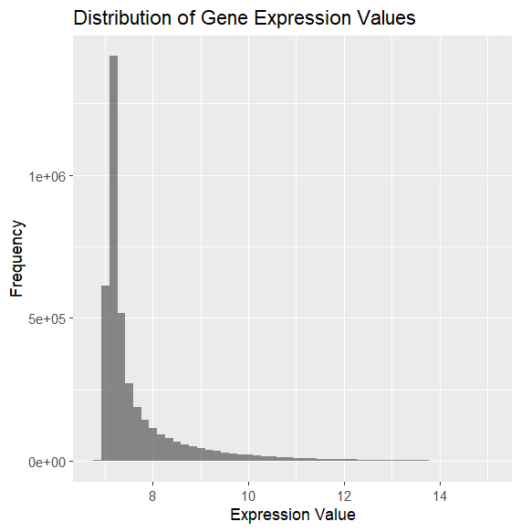
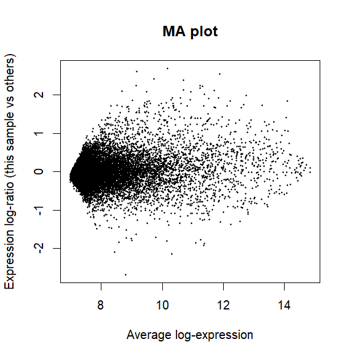
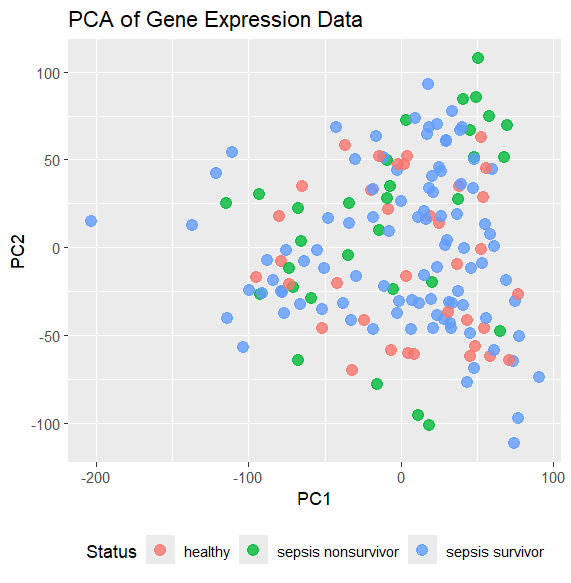

# Embeddings

Embeddings provided in: [`models/executions/`](../models/executions/)

```
├── GSE54514_enriched_ontology_degfilterv2.9_edge_attributes.csv
├── GSE54514_enriched_ontology_degfilterv2.9_node_features.csv
├── GSE54514_enriched_ontology_degfilterv2.9_outputmodel_ComplEx_entity_embeddings.npy
├── GSE54514_enriched_ontology_degfilterv2.9_outputmodel_ComplEx_entity_mapping.csv
├── GSE54514_enriched_ontology_degfilterv2.9_outputmodel_ComplEx_loss_plot.png
├── GSE54514_enriched_ontology_degfilterv2.9_outputmodel_ComplEx_losses.csv
├── GSE54514_enriched_ontology_degfilterv2.9_outputmodel_ComplEx_relation_embeddings.npy
├── GSE54514_enriched_ontology_degfilterv2.9_outputmodel_ComplEx_relation_mapping.csv
├── GSE54514_enriched_ontology_degfilterv2.9_outputmodel_ComplEx_relationship_metrics_rank.csv
├── GSE54514_enriched_ontology_degfilterv2.9_outputmodel_ComplEx_times.csv
├── GSE54514_enriched_ontology_degfilterv2.9_outputmodel_RGCN_entity_embeddings.npy
├── GSE54514_enriched_ontology_degfilterv2.9_outputmodel_RGCN_entity_mapping.csv
├── GSE54514_enriched_ontology_degfilterv2.9_outputmodel_RGCN_loss_plot.png
├── GSE54514_enriched_ontology_degfilterv2.9_outputmodel_RGCN_losses.csv
├── GSE54514_enriched_ontology_degfilterv2.9_outputmodel_RGCN_relation_embeddings.npy
├── GSE54514_enriched_ontology_degfilterv2.9_outputmodel_RGCN_relation_mapping.csv
├── GSE54514_enriched_ontology_degfilterv2.9_outputmodel_RGCN_relationship_metrics_rank.csv
├── GSE54514_enriched_ontology_degfilterv2.9_outputmodel_RGCN_times.csv
└── GSE54514_enriched_ontology_degfilterv2.9_predicate_stats.csv
```

Notice there are two models trained: ComplEx and RGCN

the files are splitted to: 

- edge_attributes.csv : the edge attributes used in the graph
- node_features.csv : the node features used in the graph
- 5 (csv) files per model: entity mapping, losses, relationship metrics, relation mapping and times
- 2 (npy) files per model: entity embeddings and relation embeddings
- loss plot (png) per model
- predicate stats (csv) : statistics about the predicates in the knowledge graph (edge types counts)

## Node features

The node attributes consist of entries of either type `Sample_xxx` representing samples in `GSE54514` dataset or `Pathway_xxx` (i think all from Reactome) representing biological pathways, note that `node_id` are redundant (primary key in this case is `node_id` + `name_feature`, the value is in `value_feature` column)

- $\rightarrow$ 6698 are pathway features with 5 possible name features ('`hasName`', '`hasDescription`', '`hasID`', '`hasPValue`', '`hasURI`') corresponding to 1556 features
- $\rightarrow$ 1467 are sample features, with 9 possible name features ('`hasDiseaseStatus`', '`hasGroupDay`', '`hasGroupId`', '`hasGender`','`hasAge`', '`hasSeverity`', '`hasSiteOfInfection`', '`hasTissue`','`hasNeutrophilProportion`') corresponding to the 163 samples in the dataset


| node_id               | name_feature       | value_feature                     |
|-----------------------|--------------------|------------------------------------|
| Sample_GSM1317896     | hasDiseaseStatus   | healthy                            |
| Pathway_R-HSA-9819196 | hasName            | Zygotic genome activation (ZGA)    |


## Edge attributes

The edge attributes represent `subject-predicate-object` triples in the knowledge graph where object-subject pairs are either protein-protein or sample-protein nodes  and predicate is the type of interaction between them (physical, genetic interaction, has geneE group xT...) $\rightarrow$ 8165 protein-protein edges in total, 6 types of predicates ('`hasPhysicalInteractionWith`', '`hasGeneticInteractionWith`','`hasGeneEGroup_1T`', '`hasGeneEGroup_2T`', '`hasGeneEGroup_3T`','`hasGeneEGroup_4T`')


| subject           | predicate                  | object           | nameAnnotation     | value       |
|------------------|----------------------------|------------------|--------------------|-------------|
| Protein_AASDHPPT | hasPhysicalInteractionWith | Protein_STIL     | hasScoreInteraction| 0.845939962 |
| Sample_GSM1317896  | hasGeneEGroup_1T    | Protein_AASDHPPT | hasExpressionValue  | 7.289391041  |




questions:

- [ ] *how they connected gene/protein with pathway?*  
- [ ] *how were the models trained from node and edge attributes?*


## big picture

The knowledge graph is constructed such that samples are connected to proteins based on their gene expression levels (differentially expressed _protein-coding_ genes $\rightarrow$ proteins), and proteins are interconnected based on known biological interactions (ppi databases).  
As for pathway nodes, each protein should be asscoaited with a pathway even though the link is still not clear to me. The pathway can has a hasPValue feature encoding this pvalue meaning pathway enrichment have been computed, thus maybe a set of genes (proteins) are linked to a pathway if they are part of it and differentially expressed in the dataset


## Ontologies 

In `output/` there are 2 files: one `.owl` file and the otehr is a csv file containing ontologies stats (type, name and count)

The type is either `class`, `ObjectProperty` or `AnnotationProperty`. These are standard OWL ontology components:  

- Classes represent concepts or categories in the ontology (501 GO terms here `GO_xxx`, `Protein`, `Pathway`, `PatientSample`, `Reaction`)  
- ObjectProperties define relationships between two classes (e.g., `hasPartGO`,`hasModification`...) 
- AnnotationProperties (e.g., `hasDiseaseStatus`, `hasPValue`...) 

Types of different edges (from python processing using owl2 and networkx): '`isAssociatedWithProteinPathway`', '`isExpressedBy`', '`partOfPathway`', '`negativelyRegulatesGO`', '`hasFunctionalInteractionWith`', '`hasGeneEGroup_4T`', '`hasGeneEGroup_4`', '`isAssociatedWithGOT`', '`isAssociatedWithGO`', '`is_a`', '`isAssociatedWithGenePathway`', '`containedIn`', '`hasCoExpressionWith`', '`participatedIn`'


Number of nodes (classes): 39912
Number of edges (relationships): 61733


# Data


```bash
curl https://ftp.ncbi.nlm.nih.gov/geo/series/GSE54nnn/GSE54514/suppl/GSE54514%5Fnon%2Dnormalized.txt.gz -o data/GSE54514_non-normalized.txt.gz
gunzip data/GSE54514_non-normalized.txt.gz
```

not very useful... will make some edits on `load_dataset.py` to save the data matrix in `data/` folder
```
data/
├── GPL6947-13512.txt
├── GSE54514_expression.csv
├── GSE54514_family.soft.gz
├── GSE54514_non-normalized.txt
├── GSE54514_samples.csv
└── README.md
```

Preliminary visualization (limma and ggplot2):

| data distribution | MA plot | PCA plot |
|---------|--------------------|----------|
|  |  |  |

Not sure these are actually processed, especially from pca plot there is no clear seperation based on biological variability, it could be due to the fact that these data are taken from same subjects at different timepoints (day0 - day5) so there might be some paired structure that needs to be taken into account or batch effects...