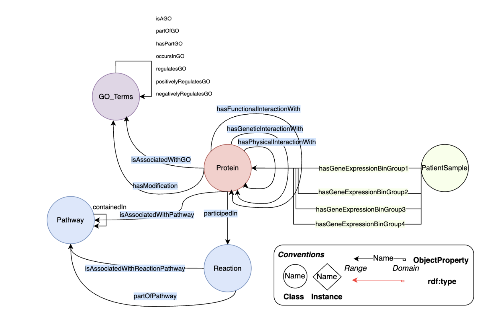

# Notes - Understanding the Project

## 1. Knowledge Graph

### Objective
Transform existing biological knowledge into a structured network.

### Nodes = Biological Entities
- Genes
- Proteins
- Biochemical reactions
- Pathways
- GO terms (Gene Ontology)
- Patient samples

Each node represents a biological element whose information we want to encode.

### Edges = Biological Relations
Sources: UniProt, Reactome, STRING, BioGRID, etc.

Examples of relations:
- gene → produced protein
- protein ↔ protein-protein interaction
- protein → participates in → pathway
- gene → annotated with → GO term




### Graph description files

#### *_edges_attributes.csv
**Role**: Graph edges attributes (weights, types, etc.)

**Format**: `subject, predicate, object, nameAnnotation, value`

  - **subject**: Source node (e.g., Sample_GSM1317896, Protein_ACTB)
  - **predicate**: Relation type (see types below)
  - **object**: Target node (e.g., Protein_AASDHPPT)
  - **nameAnnotation**: Relation attribute type (e.g., hasScoreInteraction, hasExpressionValue)
  - **value**: Attribute value (score, expression value, etc.)

**Examples**:

| subject | predicate | object | nameAnnotation | value |
|---------|-----------|--------|----------------|-------|
| Sample_GSM1317896 | hasGeneEGroup_1T | Protein_AASDHPPT | hasExpressionValue | 7.289 |
| Protein_ACTB | hasPhysicalInteractionWith | Protein_ACTR3 | hasScoreInteraction | 0.93 |

#### *_node_features.csv
**Role**: Clinical/biological metadata of entities

**Format**: Long format (`node_id, name_feature, value_feature`)
- 1 row = 1 node attribute (not 1 edge)

**Feature examples**:
- **Patients**: age, gender, survival days, disease status, etc.
- **Pathways**: name, description, source url, etc.

**Examples**:

| node_id | name_feature | value_feature |
|---------|--------------|---------------|
| Sample_GSM1317896 | hasDiseaseStatus | healthy |
| Sample_GSM1317896 | age | 65 |

**GNN model**: OWL file used to build the KG 
> **📌 TODO:** : ask Laura for her OWL file 

---

## 2. Embeddings

### Objective
Transform each graph node into a fixed-dimension numerical vector.

### Models Used

#### ComplEx (Complex Embeddings)
- Represents each node and relation in a **complex space** (real + imaginary parts)
- Advantages:
  - Handles **asymmetric relations** (e.g., A regulates B ≠ B regulates A)
  - Adapted for multi-relational graphs
- Trained with PyKEEN

#### RGCN (Relational Graph Convolutional Network)
- GCN specialized for graphs with **multiple relation types** (pathway, interaction, annotation, etc.)
- Mechanism: **Message passing** accounting for edge type
- Computation: `gene_vector = weighted_average(neighbor_vectors) + relation_type`
- Trained with PyKEEN

### Output File

**`*_entity_embeddings.npy`**
- **Format**: Numpy array `(n_entities, embedding_dim)`
- **Content**: Vectors for ALL entities (patients, genes, pathways, etc.)
- **Indexing**: Numeric `entity_id` (0, 1, 2, ...)
- **Origin**: Trained by PyKEEN (ComplEx or RGCN)

---

## 3. Gene Expression Datasets

### GSE54514_family.soft.gz

**Format**: `probe × patient` matrix

**Example**:
```
Probe ID      | Sample1 | Sample2 | Sample3 | ...
------------- | ------- | ------- | ------- | ---
ILMN_1796063  |   7.2   |   6.8   |   7.5   | ...
ILMN_1804174  |   8.3   |   7.6   |   8.2   | ...
ILMN_1725881  |   8.1   |   7.8   |   8.3   | ...
```

**Problem**: Multiple probes can target the same gene!
- **Question**: Which value to keep?
- **Solution**: Aggregate values (mean, median, max variance, etc.)
- **Example**: `mean(7.2, 7.5) = 7.35`


> **📌 TODO :** define aggregation function before creating gene expresison matrix.

### GPL6947-13512.txt

**Type**: Metadata file (probe → gene dictionary)

**Role**: Mapping probes to gene identifiers

**Content**: 1 row = 1 probe from Illumina GPL6947 DNA microarray

**Main columns**:
- `ID`: Probe identifier (e.g., `ILMN_1796063`)
- `Entrez_Gene_ID`: Target gene (e.g., `54765` for TRIM44)
- `Symbol`: Gene name (e.g., `TRIM44`)
- `SEQUENCE`: Probe DNA sequence

**Essential usage**: Without this file, impossible to know which genes are measured!

---

## 4. Output DataFrames (load_embeddings.py)

### df_patients

**Content**: Only patients (biological samples)

**Columns**:
- `entity_id`: PyKEEN numeric index (0, 1, 2, ...)
- `label` / `node_id`: Patient ID (e.g., "Sample1", "Sample2")
- `hasDiseaseStatus`: Clinical status (e.g., "sepsis" or "healthy")
- `embedding`: Patient embedding vector
- Other clinical features (age, survivalDays, etc.)

**Filtering**: Keeps only nodes starting with `"Sample_"`

**Usage**: Supervised classification (predict sepsis vs healthy)

### df_all

**Content**: ALL entities from the knowledge graph

**Included entities**:
- Patients (~163)
- Genes (~20,000)
- Pathways (~500)
- Other biological concepts

**Columns**:
- `entity_id`: PyKEEN index
- `label`: Entity identifier (varies by type)
- `embedding`: Embedding vector
- Entity-associated features

**Usage**: Complete network analysis, visualization, explainability

### Construction (merge pipeline)

#### Step 1: Pivot node_features.csv
```
node_id  | hasDiseaseStatus | age | survivalDays
-------- | ---------------- | --- | ------------
Sample1  | sepsis           | 65  | 28
Sample2  | healthy          | 52  | NA
```

#### Step 2: Merge mapping + features + embeddings
```
entity_id | label   | hasDiseaseStatus | age | embedding
--------- | ------- | ---------------- | --- | ---------
0         | Sample1 | sepsis           | 65  | [0.2, -0.5, ...]
1         | Sample2 | healthy          | 52  | [0.1, 0.3, ...]
```

#### Step 3: Create both DataFrames
- **df_patients**: Filter on `label` containing "Sample_"
- **df_all**: Keep all entities

### Summary Diagram

```
entity_embeddings.npy     entity_mapping.csv     node_features.csv
(vectors)            +    (ID ↔ label)      +    (metadata) pivoted
      ↓                          ↓                      ↓
      └──────────────────────────┴──────────────────────┘
                                 ↓
                          df_merged (all entities)
                                 ↓ (filter "Sample*")
                          df_patients (patients only)
```


---

## 5. Using Embeddings

### Types of Embeddings

The knowledge graph produces **two types of embeddings**:
1. **Entity embeddings**: Vectors representing nodes (patients, genes, pathways, etc.)
2. **Relation embeddings**: Vectors representing edge types (interactions, annotations, etc.)

**Current focus**: Entity embeddings only

> **📌 TODO:** Ask about the potential use of relation embeddings in our case

### Available Entity Embeddings

| Entity Type | Dimension | Count | Considerations |
|-------------|-----------|-------|----------------|
| **Patient** | 128 | ~163 | Already many features relative to sample size → risk of overfitting |
| **Gene** | 128 | ~15,752 | Need aggregation strategy for patient-level representation |
| **Pathway** | 128 | ~500 | Is concatenation relevant? High-dimensional effect to consider |

**⚠️ High-dimensionality warning**:
- Adding 128-dimensional embeddings with only 163 samples increases overfitting risk
- Careful feature selection and regularization required
- Consider dimensionality reduction (PCA, autoencoders) before integration

> **📌 TODO:** Define concatenation strategies of embeddings


---


### Essential Files

| File | Type | Role |
|---------|------|------|
| `GSE54514_family.soft.gz` | Expression | Probe × patient data |
| `GPL6947-13512.txt` | Mapping | Probe → Entrez_Gene_ID |
| `*_entity_embeddings.npy` | Embeddings | Vectors (n_entities, dim) |
| `*_entity_mapping.csv` | Mapping | entity_id ↔ label |
| `*_node_features.csv` | Metadata | Clinical/biological features |

### Next Steps

1. Implement probe → gene aggregation function (line `load_dataset.py:136`)
2. Test both pipelines (with/without embeddings)
3. Compare performances (ROC-AUC, F1-score)
4. Analyze feature importance (interpretability)

---

### Visualisation / Data exploration 

#### Phenotypic Variables Analysis : 

- **Age Distribution par Groupe** -  Kruskal-Wallis p < 0.001 ***

- **Gender Distribution par Groupe** - Chi² test p = 0.7053 ns 


- **APACHE II Severity Score (Sepsis patients seulement)** - Mann-Whitney p < 0.001 ***


> **📌 TODO :** Linear regression (control effect of cofounders factors such as age)

### Genes - Probes mapping :


Microarrays technology can use multiple probes to measure the expression of a single gene.
Must work on gene level (not probe level) → aggregation step needed.

Recommanded one : **Weighted mean aggregation** (weight = expression value of each probe)


#### Gene expression profiles : 


*Based on gene expression matrix (we mapped probes to genes by aggregating multiple probes per gene with mean weighted value)*

**No clear clustering** in the first 2 principal components between our 3 sub-groups, the first components don't explain much variance (C1 : ~12%, C1 + C2 : ~22%)


